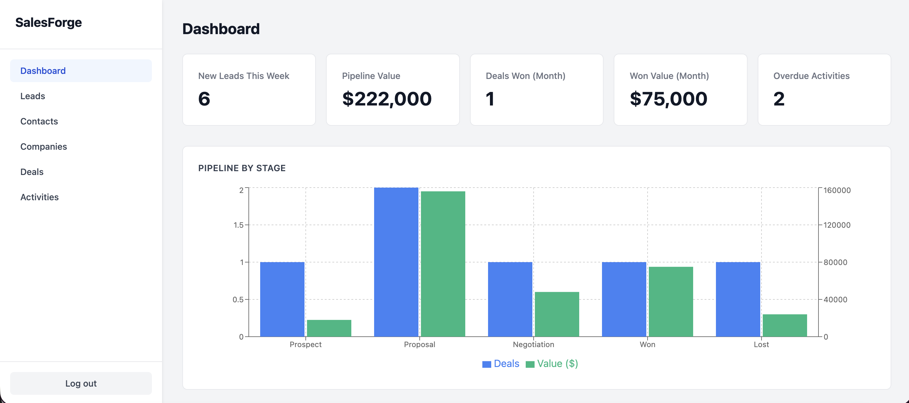
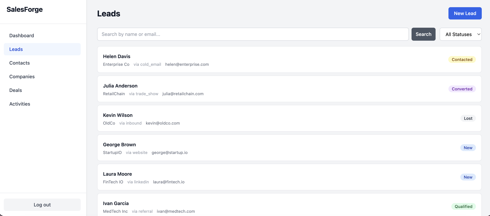
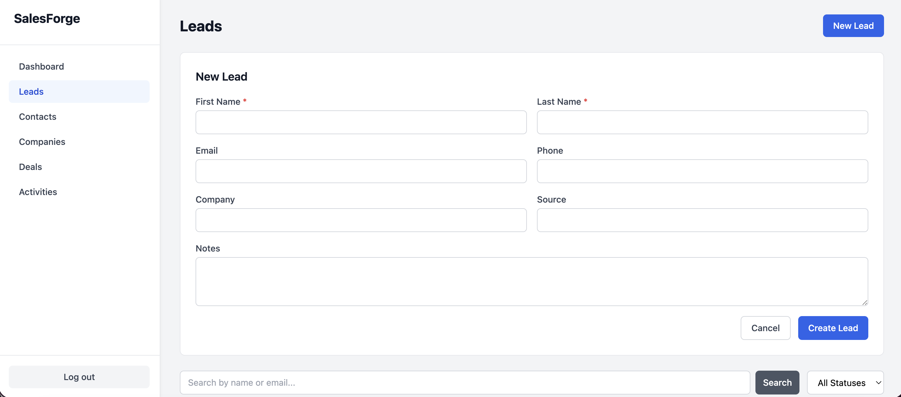
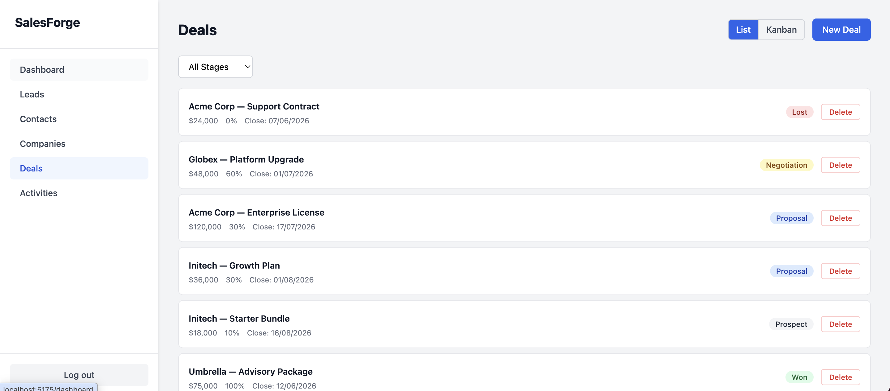
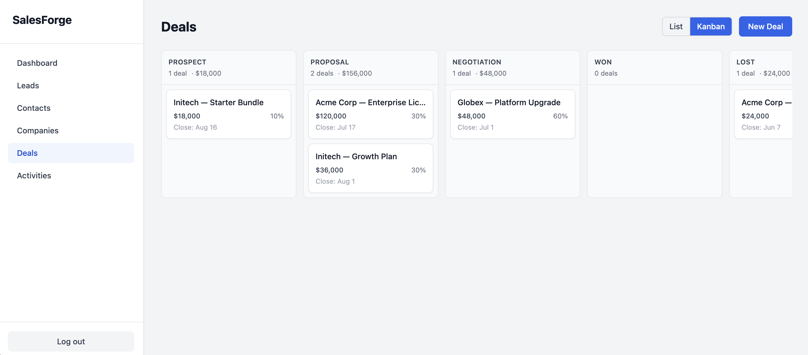
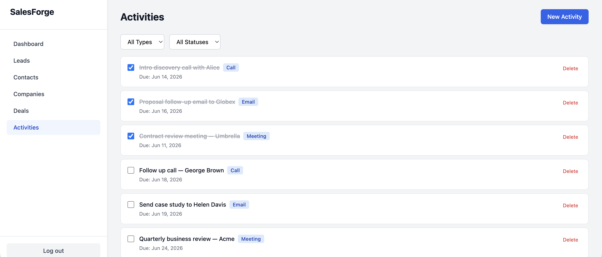
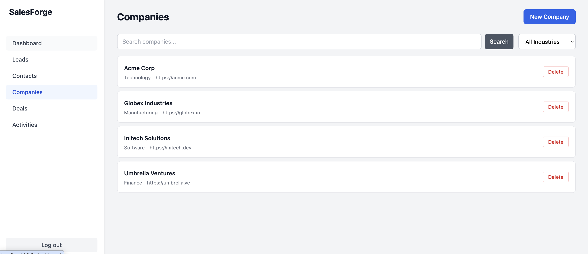

# meta-swarm-learning

A learning project exploring [metaswarm](https://github.com/dsifry/metaswarm) — a multi-agent orchestration framework for Claude Code. The application being built is **SalesForge**, a Sales CRM with a FastAPI backend and React frontend.

## Project: SalesForge CRM

A full-stack CRM application used as the development substrate for experimenting with metaswarm's agent workflows and quality gates.

### Tech Stack

| Layer | Stack |
|---|---|
| Backend | FastAPI, SQLAlchemy, SQLite (dev) / PostgreSQL (prod), Alembic, pytest |
| Frontend | React + TypeScript, Vite, React Query, React Router, Recharts, Tailwind CSS |
| Auth | JWT (access token 30 min, refresh token 7 days) |
| Tooling | ruff, mypy, vitest |

### Features (Spec-Driven)

| Spec | Feature |
|---|---|
| `specs/001-auth` | Authentication & JWT |
| `specs/002-leads` | Lead management + conversion |
| `specs/003-contacts` | Contact management |
| `specs/004-companies` | Company/account management |
| `specs/005-deals` | Deal pipeline + Kanban board |
| `specs/006-activities` | Activity tracking |
| `specs/007-dashboard` | Dashboard KPIs + charts |

### Project Structure

```
salesforge/
├── backend/          # FastAPI app
│   ├── app/
│   │   ├── api/      # Route handlers
│   │   ├── core/     # Config, security, deps
│   │   ├── models/   # SQLAlchemy models
│   │   ├── schemas/  # Pydantic schemas
│   │   └── services/ # Business logic
│   └── tests/
├── frontend/         # React app
│   ├── src/
│   │   ├── components/
│   │   ├── pages/
│   │   ├── hooks/
│   │   ├── api/      # React Query hooks
│   │   └── types/
│   └── tests/
└── specs/            # Feature specs (source of truth)
```

### Quick Start

```bash
# Backend
cd salesforge/backend
pip install -e .
uvicorn app.main:app --reload

# Frontend
cd salesforge/frontend
npm install
npm run dev
```

### Commands

```bash
# Backend
cd salesforge/backend
pytest                          # run tests
pytest --cov --cov-fail-under=80  # with coverage gate
ruff check .                    # lint

# Frontend
cd salesforge/frontend
npm run test                    # run tests
npm run test:coverage           # with coverage
npm run lint                    # lint
```

## Screenshots

### Dashboard


### Leads


### New Lead Form


### Deals — List View


### Deals — Kanban Board


### Activities


### Companies


## metaswarm Workflow

This project is configured with metaswarm for multi-agent orchestration. The key commands:

| Command | Purpose |
|---|---|
| `/start-task` | Begin tracked work on a task |
| `/prime` | Load relevant knowledge before starting |
| `/create-issue` | Create a well-structured GitHub Issue |
| `/pr-shepherd <pr>` | Monitor a PR through to merge |
| `/self-reflect` | Extract learnings after a PR merge |

**Quality gates enforced:** Design Review (5 agents), Plan Review (3 adversarial reviewers), 80% test coverage before PR creation.
